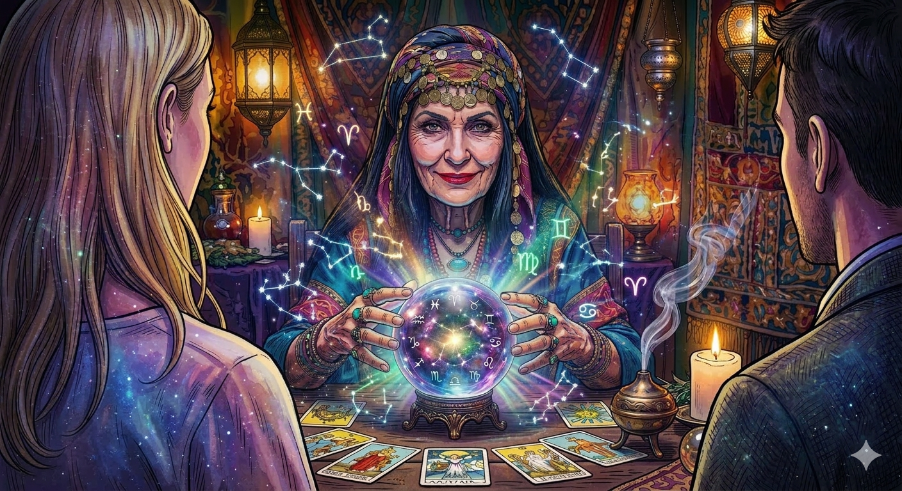

# Akinator Signos ♈
" Onde a lógica dos grafos encontra o mistério dos astros. 🔮✨"

[](https://www.python.org)
[](https://streamlit.io)
[](https://docs.pytest.org)



<sub><i>Imagem Gerada pelo Gemini, usando o modelo Nano Banana 2</i></sub>


Sistema de adivinhação de signos do zodíaco inspirado no Akinator.
Desenvolvido com árvore binária de decisão, BFS e DFS em Python.

## ✨ Sobre o projeto 
🔮 O destino não é linear, mas a Madame Dira sabe percorrê-lo! Usando uma estrutura de Árvore Binária de Decisão, ela filtra as Constelações do Zodíaco até encontrar o seu signo em no máximo 4 perguntas. Você escolhe se ela deve ser metódica (BFS) ou direta ao ponto (DFS)
A árvore foi projetada de forma balanceada, garantindo que todos os 12 signos sejam alcançados em no máximo 4 perguntas.

## Tecnologias

- Python 3
- Streamlit
- pytest
- graphviz

## 📚 Bibliotecas e Módulos

### Externas (pip install)
| Biblioteca | Função | Documentação |
|------------|--------|--------------|
| `streamlit` | Framework de frontend | [docs.streamlit.io](https://docs.streamlit.io) |
| `graphviz` | Renderiza a árvore visualmente | [graphviz.readthedocs.io](https://graphviz.readthedocs.io) |
| `pytest` | Framework de testes | [docs.pytest.org](https://docs.pytest.org) |


### Nativas do Python
| Biblioteca | Função |
|------------|--------|
| `pathlib` | Manipula caminhos de arquivos de forma elegante |
| `base64` | Converte a imagem da Madame Dira para embutir no HTML |
| `sys` | Adiciona o diretório `src/` ao caminho de importação |
| `os` | Lê o caminho absoluto do arquivo atual |
| `collections` | Fornece o `deque` usado na fila do BFS |

### Módulos do projeto
| Módulo | Função |
|--------|--------|
| `node.py` | Define a classe Node da árvore |
| `tree.py` | Constrói a árvore de decisão com os 12 signos |
| `dfs.py` | Implementa os algoritmos DFS |
| `bfs.py` | Implementa os algoritmos BFS |
| `game.py` | Simulação do jogo via terminal |
| `app.py` | Interface Streamlit |

## ⚙️ Por onde começar

```bash
# Clone o repositório
git clone https://github.com/RyanGCassimiro/akinator-signos.git
cd akinator-signos

# Crie e ative o ambiente virtual
python3 -m venv venv
source venv/bin/activate  # Mac/Linux
# venv\Scripts\activate   # Windows

# Instale as dependências
pip install -r requirements.txt

# Rode o Streamlit
streamlit run src/app.py
```

## 🌳 Estrutura do Projeto

```
akinator-signos/
├── assets/
│   ├── madame_dira.png
├── src/
│   ├── app.py          ← Interface Streamlit
│   ├── bfs.py          ← Algoritmo BFS
│   ├── dfs.py          ← Algoritmo DFS
│   ├── game.py         ← Simulação do jogo (input s/n)
│   ├── node.py         ← Classe Node
│   └── tree.py       ← Montagem da árvore de signos
├── tests/
│   └── test_tree.py  ← Testes com pytest
├── .gitignore
├── pytest.ini
├── README.md
└── requirements.txt
```

## 🧪 Testes


pytest tests/

## 🔮 Como Jogar
1. Pense em um signo do zodíaco - pode ser o seu ou qualquer outro.
2. Responda às perguntas da Madame Dira com *Sim* ou *Não*.
3. Veja a árvore se atualizar em tempo real enquanto o caminho é percorrido
4. Descubra se Madame Dira acertou e compare os algoritmos!

## 🔢 Algoritmos

### ↔️ BFS (Busca em Largura)
Percorre a árvore nível por nível usando uma fila (`deque`). Útil para encontrar o caminho mais curto até um signo.

### ↕️ DFS (Busca em Profundidade)
Percorre a árvore seguindo um caminho até o fim antes de voltar. Simula o fluxo natural de perguntas do jogo.

## Árvore de Decisão

A árvore está organizada por **elemento** (fogo, terra, ar e água), e usamos perguntas relacionadas a **data de aniversário** para chegar a um resultado que a Madame Dira irá resolver sobre os 12 signos. Projetamos essa árvore de manenira que fosse balanceada, dessa forma todos os signos seriam alcançados em no máximo **4 perguntas**, possibilitando que Madame Dira possa atender os seus clientes mais rápidamente.

          [ Pergunta Nível 1 ]
             /            \
     [ Resposta Sim ]    [ Resposta Não ]
        /      \            /      \
    [ Nó L ]  [ Nó R ]   [ Nó L ]  [ Nó R ]

### ⚖️ Fluxo de Decisão (Exemplo de Caminho)

Abaixo, um exemplo de como a árvore filtra as opções para chegar ao resultado em poucas etapas:


| Nível | Pergunta Exemplo | Destino (Sim) ✅ | Destino (Não) ❌ |
| :---: | :--- | :--- | :--- |
| **1** | É um signo de **Fogo** ou **Ar**? | ➡️ Nível 2 (Fogo/Ar) | ➡️ Nível 2 (Terra/Água) |
| **2** | O signo é regido pelo **Sol**? | 🦁 **Leão** | 🔍 Próxima pergunta... |
| **3** | É o **primeiro** do zodíaco? | 🐐 **Áries** | 🏹 **Sagitário** |

> 💡 *Nota: O sistema percorre até 4 níveis para garantir a precisão em todos os 12 signos.*

## Integrantes

- [Ryan Cassimiro](https://github.com/RyanGCassimiro)
- [Wanessa Costa](https://github.com/wanessa-aac)

## 🎨 Créditos

- Imagem da Madame Dira gerada com **Google Gemini (modelo Nano Banana 2)**
- O prompt foi refinado em 5 iterações até chegar no resultado final:

  1. *"Tenho um trabalho parecido com o akinator, só que a nossa personagem principal deve ser uma cigana lendo a bola de cristal ou a mão da pessoa para adivinhar o signo."*
  2. *"Deixe o cabelo da cigana preto e liso, suavize as rugas, porém de vista de frente, olhando para cliente, a cliente fica de costas para o espectador..."*
  3. *"Suaviza um pouco as rugas e curve ligeiramente os cantos da boca como se estivesse sorrindo amigavelmente. Deixe os olhos castanho claro."*
  4. *"Todos na imagem devem parecer uma ilustração, e como tem um outro ombro sem ser a cliente, que o outro cliente seja um homem..."*
  5. *"Agora cria outra variação dessa ilustração, no qual a bola de cristal está emitindo uma luz, e os símbolos do zodíaco e constelações se projetam tipo um planetário..."*
     
- Parte do código e interface desenvolvidos com auxílio do **Claude.ai (Anthropic)**
